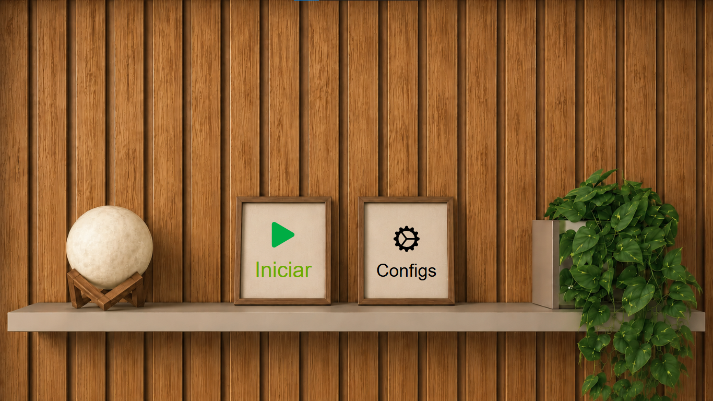
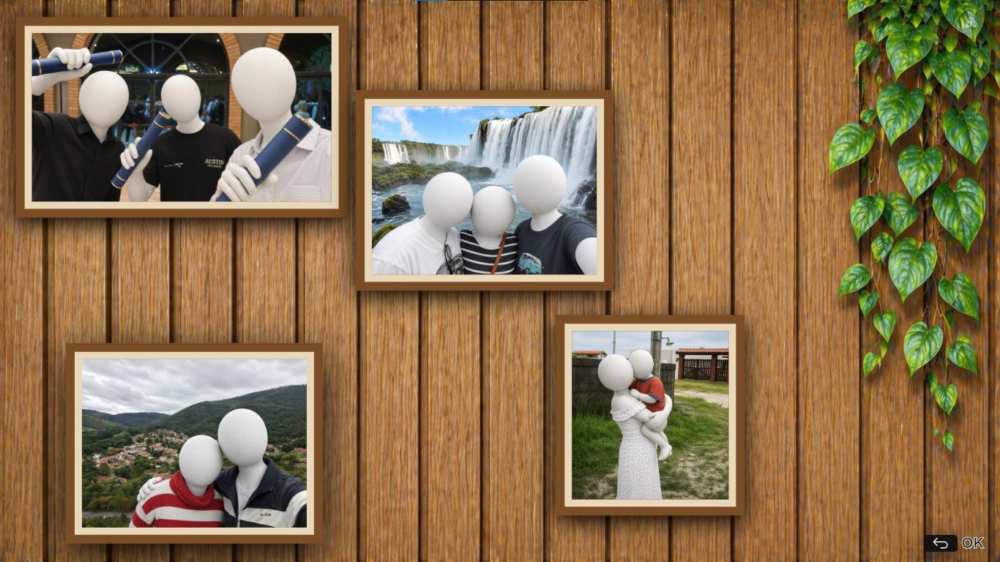
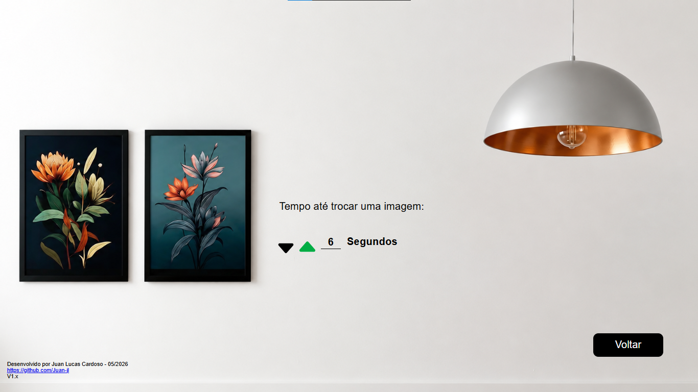

# Estante

App para LG WebOS TV que exibe imagens em um slideshow automático, alternando entre 4 frames simultaneamente.

[Link para a documentação](docs/Documentacao.pdf)

## Sobre

O Estante foi desenvolvido para transformar sua TV LG em um quadro digital, exibindo suas próprias imagens de forma contínua e organizada.

## Requisitos

- Preferencialmente TVs LG com WebOS 25 ou superiror.

## ⚠️ Configuração obrigatória antes de empacotar

Por uma limitação do WebOS, não é possível acessar arquivos externos como um pendrive conectado à TV — que era a ideia original do app. Por isso, as imagens precisam ser incluídas diretamente no pacote do app antes de instalar.

**Siga os passos abaixo antes de empacotar:**

1. Adicione suas imagens na pasta `media/` — recomendado ao menos 4 imagens
2. As imagens devem seguir uma sequência numérica exata, começando em `1`, sem pular números (ex: `1.jpg`, `2.jpg`, `3.jpg`...)
3. Todas as imagens devem ter a mesma extensão
4. No arquivo `js/configs.js`, ajuste:
   - `numberOfImages` — quantidade total de imagens adicionadas na pasta `media/`
   - `imagesExtension` — extensão das imagens (ex: `.jpg`, `.png`)

## Funcionalidades

- Slideshow automático com 4 imagens exibidas simultaneamente
- Tempo de exibição configurável diretamente pelo app
- Navegação completa pelo controle remoto

## Nota sobre o uso de IA

Partes que envolvem integração com APIs específicas do WebOS foram desenvolvidas com auxílio de IA. A documentação da plataforma é escassa e a comunidade de desenvolvedores é pequena, o que torna referências práticas difíceis de encontrar. O uso de IA foi uma escolha técnica para contornar essa limitação, restrita aos pontos onde a falta de material tornaria o desenvolvimento inviável.

## Capturas de tela

HOME

SHOW

SETTINGS

## Desenvolvido por

Juan Lucas Cardoso — 05/2026  
[github.com/Juan-jl](https://github.com/Juan-jl)
